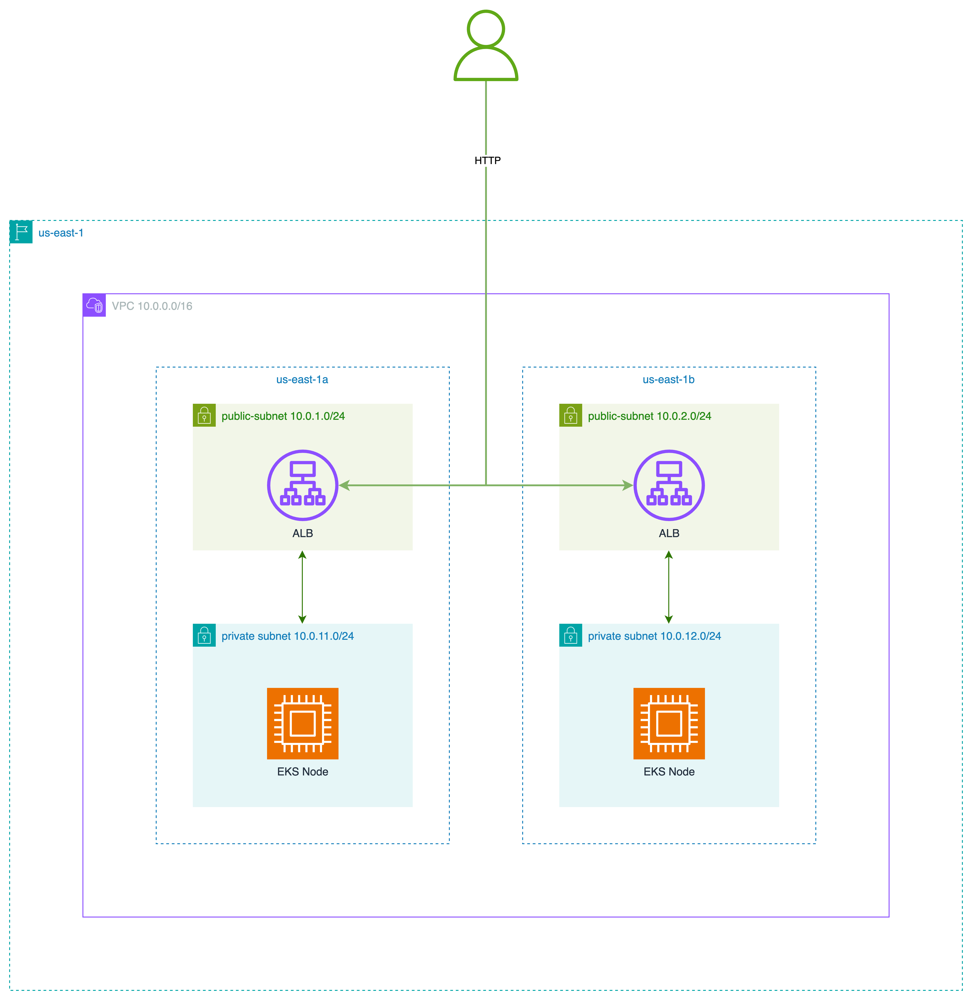

# terraform-example

## Why Kubernetes?
Kubernetes (EKS) has become the standard approach to run production workloads among multiple companies.

In a given scenario, it provides simplicity of:
- Deploying desired docker workloads `nginx:alpine`
- Built-in operators into EKS provide an easy way of creating and managing AWS resources like: `ALB`, `ASG`, `SG`
- Built-in Karpenter allows us to choose multiple flavours of instances for our workloads without manually creating a single node_group.

Also, the company already utilizes Kubernetes, which should be a known solution for teams.

## Infrastructure Diagram


### Public Subnets
To make the infrastructure more secure, public subnets host only `ALB`, `IGW`, and `NAT` resources.

You can change public subnets settings by configuring this variable: `public_subnets = ["10.0.1.0/24", "10.0.2.0/24"]`

### Private Subnets
Private subnets are used to host EKS nodes and our workloads. This is the recommended way to host workloads for better security.

You can change private subnets settings by configuring this variable: `private_subnets = ["10.0.11.0/24", "10.0.12.0/24"]`

### Security Groups
Because we are using the `EKS automode`, operator creates the ASG automatically and allows only traffic inside
the K8S cluster and `HTTP` traffic from the `ALB`.

### Kubernetes manifests
For the simplicity of this demo, we are using plain Kubernetes manifests to deploy k8s resources.
`HELM` charts would be a better way of deploying the workloads to the cluster.

You can find and adjust manifests in the `manifests` folder:

```shell
alb-ingress-class-param.yaml
alb-ingress-class.yaml
alb-ingress.yaml
deployment.yaml
nodepool.yaml
service.yaml
```

`alb-ingress-class-param.yaml` `alb-ingress-class.yaml` and `alb-ingress.yaml` configure ALB settings.

`deployment.yaml` - is used to declare our deployment. You can change `image` or `replica` count in this file.

`nodepool.yaml` - is used to configure the nodepool that we will spin up for our workloads. We use `SPOT` instances in our demo.

`service.yaml` - k8s resource that configures workload service.

---

## Improvements
1. Convert plain manifest to `HELM` charts for better flexibility of the workload deployments
2. Add ability to configure other team members to access the cluster.
3. Remove some static configurations from modules to be more flexible in resource namings

```terraform
#-----------------------------------------------------------------------------------------------------------------------
# Ingress Info
#-----------------------------------------------------------------------------------------------------------------------
data "kubernetes_ingress_v1" "this" {
  metadata {
    name      = "hive-ingress"
    namespace = "default"
  }

  depends_on = [
    aws_eks_cluster.this,
    kubectl_manifest.this["alb-ingress.yaml"]
  ]
}
```
4. Find and resolve racing conditions. Sometimes you need to re-apply the config.

---

## Quick Start

1. Create `terraform.tfvars` file with the desired values:

```shell
#-----------------------------------------------------------------------------------------------------------------------
# Resource name
#-----------------------------------------------------------------------------------------------------------------------
vpc_name = "hive-vpc"
eks_name = "hive-eks"

#-----------------------------------------------------------------------------------------------------------------------
# Networking
#-----------------------------------------------------------------------------------------------------------------------
public_subnets = ["10.0.1.0/24", "10.0.2.0/24"]
private_subnets = ["10.0.11.0/24", "10.0.12.0/24"]

availability_zones = ["us-east-1a", "us-east-1b"]
enable_nat_gateway = true

#-----------------------------------------------------------------------------------------------------------------------
# Tags
#-----------------------------------------------------------------------------------------------------------------------
tags = {
  "ORG" = "Hive"
  "env" = "development"
}
```
__Refer to the table below for available parameters.__

2. Make sure your AWS user is [authenticated](https://docs.aws.amazon.com/cli/latest/userguide/cli-chap-authentication.html) and has permissions to create resources.
3. Init Terraform in the root of the git repository: `terraform init` 
4. Apply configuration in the root of the module: `terraform apply`

Spinning up the entire infrastructure and deploying workloads could take over 10 minutes.
When it's finished, you will get the public `ALB` endpoint that will deliver your requests to your workloads inside the Kubernetes cluster.

> [!WARNING]
> 
> It takes some time to provision the ALB. Go to the AWS console and wait till the ALB is fully provisioned
> before trying to access the ALB endpoint

```text
ingress_address = "http://k8s-default-hiveingr-000000.us-east-1.elb.amazonaws.com"
```

<!-- BEGIN_TF_DOCS -->
## Requirements

| Name | Version |
|------|---------|
| <a name="requirement_terraform"></a> [terraform](#requirement\_terraform) | >= 1.0.0 |
| <a name="requirement_aws"></a> [aws](#requirement\_aws) | ~> 5.0 |

## Providers

No providers.

## Modules

| Name | Source | Version |
|------|--------|---------|
| <a name="module_eks"></a> [eks](#module\_eks) | ./modules/aws/eks | n/a |
| <a name="module_vpc"></a> [vpc](#module\_vpc) | ./modules/aws/vpc | n/a |

## Resources

No resources.

## Inputs

| Name | Description | Type | Default | Required |
|------|-------------|------|---------|:--------:|
| <a name="input_availability_zones"></a> [availability\_zones](#input\_availability\_zones) | List of availability zones | `list(string)` | <pre>[<br/>  "us-east-1a",<br/>  "us-east-1b"<br/>]</pre> | no |
| <a name="input_eks_name"></a> [eks\_name](#input\_eks\_name) | Name of the VPC to create | `string` | `"hive-eks"` | no |
| <a name="input_enable_nat_gateway"></a> [enable\_nat\_gateway](#input\_enable\_nat\_gateway) | Should be true if you want to provision NAT Gateway | `bool` | `true` | no |
| <a name="input_private_subnets"></a> [private\_subnets](#input\_private\_subnets) | List of private subnets | `list(string)` | <pre>[<br/>  "10.0.11.0/24",<br/>  "10.0.12.0/24"<br/>]</pre> | no |
| <a name="input_public_subnets"></a> [public\_subnets](#input\_public\_subnets) | List of public subnets | `list(string)` | <pre>[<br/>  "10.0.1.0/24",<br/>  "10.0.2.0/24"<br/>]</pre> | no |
| <a name="input_tags"></a> [tags](#input\_tags) | Map of tags block | `map(string)` | `{}` | no |
| <a name="input_vpc_cidr"></a> [vpc\_cidr](#input\_vpc\_cidr) | CIDR of the VPC to create | `string` | `"10.0.0.0/16"` | no |
| <a name="input_vpc_name"></a> [vpc\_name](#input\_vpc\_name) | Name of the VPC to create | `string` | `"hive-vpc"` | no |

## Outputs

| Name | Description |
|------|-------------|
| <a name="output_ingress_address"></a> [ingress\_address](#output\_ingress\_address) | Publicly available ALB endpoint |
<!-- END_TF_DOCS -->

